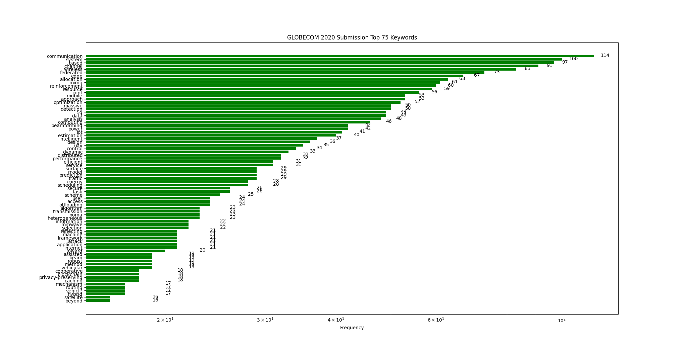
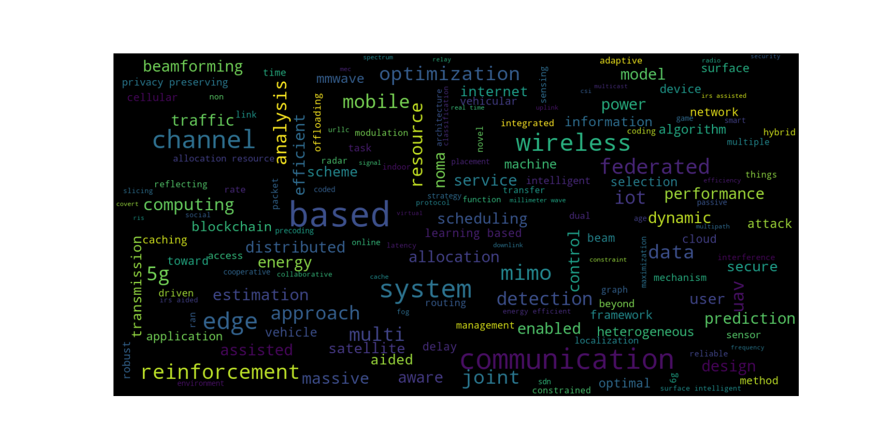
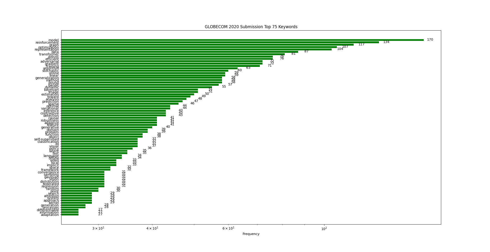
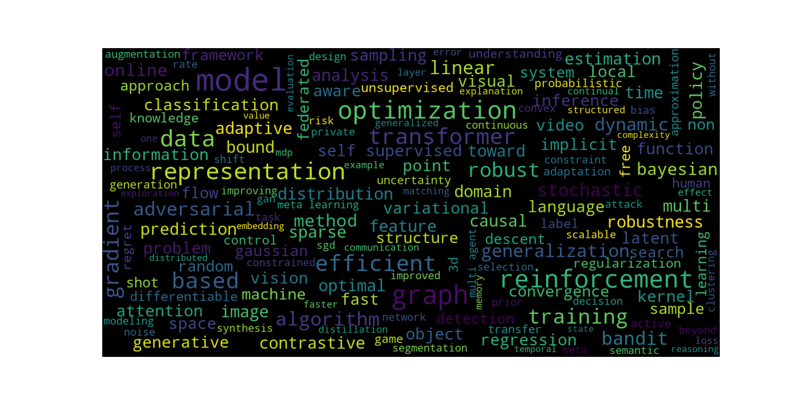
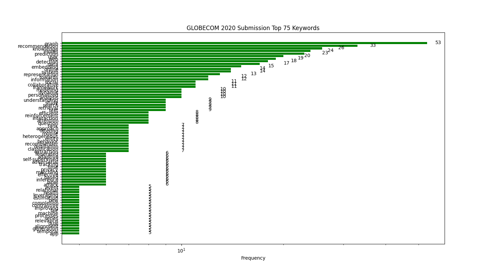
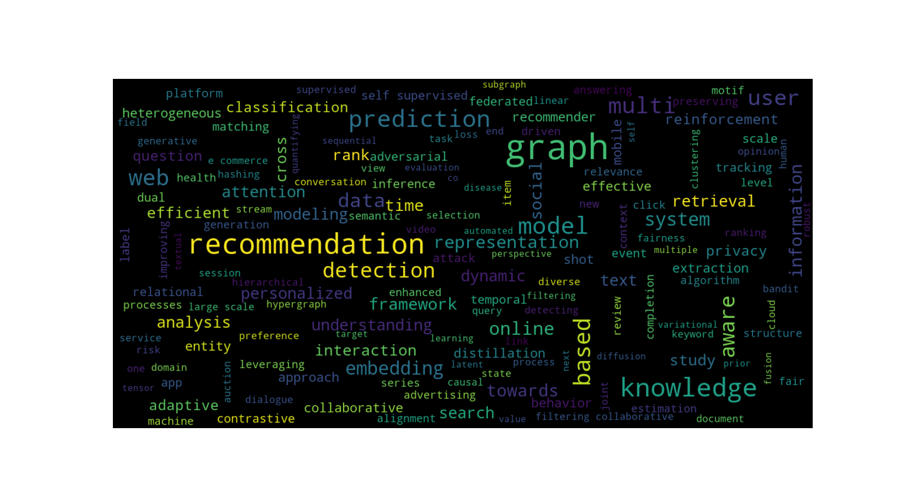

This is a statistic of keyword of GLOBECOM 2020.
## GLOBECOM 2020

## ICML2021

## GLOBECOM 2021 

[Rename rep](https://www.coonote.com/git-note/git-rename-github-push.html)

## NIPS 2021

## www 2021

Inspired by [NeurIPS-2020-Paper-Statistics](https://github.com/hoya012/NeurIPS-2020-Paper-Statistics)

